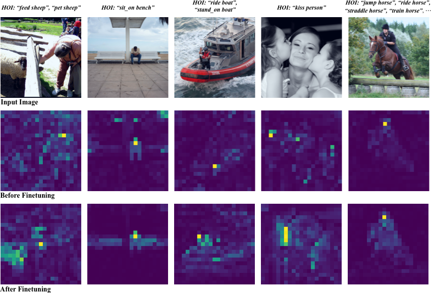
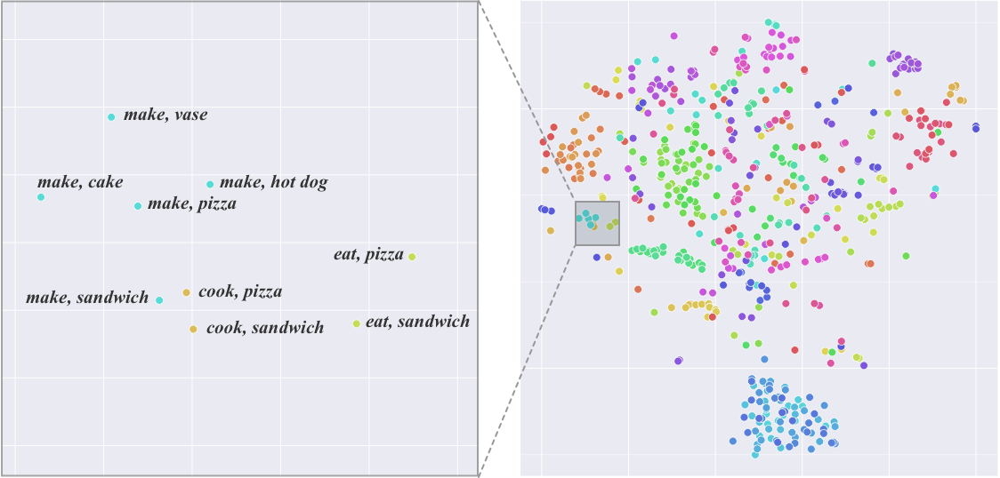

# DEFR: Detection-Free HOI Recognition

## Results

| Backbone Initialization | Classifier Initialization | Loss Function |  Full | Few@1 | Few@5 | Few@10 |
|:-----------------------:|:-------------------------:|:-------------:|:-----:|:-----:|:-----:|:------:|
| ImageNet-1K             | Random                    | BCE           | 37.77 |  7.91 | 13.45 |  14.88 |
| ImageNet-1K             | Random                    | **LSE-Sign**  | 44.07 | 14.30 | 20.03 |  22.64 |
| ImageNet-1K             | **Language** (BERT)       | BCE           | 50.56 | 20.12 | 27.75 |  29.96 |
| ImageNet-1K             | **Language** (BERT)       | **LSE-Sign**  | 53.45 | 27.23 | 35.09 |  37.10 |
| ImageNet-1K             | **Language** (CLIP)       | BCE           | 51.51 | 24.77 | 31.23 | 33.42  |
| ImageNet-1K             | **Language** (CLIP)       | **LSE-Sign**  | 54.73 | 34.75 | 39.78 |  40.84 |
| ImageNet-1K             | **Language** (SimCSE)     | **LSE-Sign**  | 53.75 | 30.26 | 37.73 |  40.04 |
| CLIP                    | Random                    | BCE           | 34.15 |  6.21 |  9.44 |  11.93 |
| CLIP                    | Random                    | **LSE-Sign**  | 36.84 | 9.48  | 13.90 | 15.85  |
| CLIP                    | **Language** (BERT)       | BCE           | 44.36 | 15.35 | 21.75 | 24.72  |
| CLIP                    | **Language** (BERT)       | **LSE-Sign**  | 50.96 | 24.80 | 31.68 | 33.57  |
| CLIP                    | **Language** (CLIP)       | BCE           | 57.88 | 42.17 | 45.71 | 46.56  |
| CLIP                    | **Language** (CLIP)       | **LSE-Sign**  | 60.50 | 49.61 | 52.60 | 52.86  |

**Insights from the results**
- ImageNet-1K is stronger than CLIP on HICO, with randomly initialized classifier
    1. Zero-shot CLIP (ViT-B/32): 25.8 mAP
    2. Linear Prob CLIP (ViT-B/32): 27.0 mAP, Linear Prob ImageNet (ViT-B/32): 33.5 mAP
    3. Linear prob is a standard way to evaluate a backbone feature for a dataset. The process is to freeze the image backbone and fit a linear regression on the training set. The evaluation result on the test set shows the feature seperability.
    4. Zero-shot CLIP (see their paper) is to use both the image encoder and text encoder (doubled model size). The classification is conducted by calculating the cosine similarity of the image embedding (ViT-B/32 backbone) and the text embedding (of the HOI sentences) from the text encoder (BERT-base architecture).
- Language Embedding Initialization boosts few-shot performance regardless of the backbone
- LSE-Sign Loss boosts few-shot performance regardless of the backbone
- How to chose the best text embedding for classifier initialization?
    1. Transformer language models > word vectors (word2vec). Encode the whole sentence instead of concatenated words
    2. Language models with an isotropic embedding space (SimCSE, CLIP) > BERT. Embeddings from an isotropic embedding space are better initial weights (feature centers). Being isotropic or not depends on the training objective. BERT is trained for filling masked words, while SimCSE and CLIP (same architecture with BERT) are contrastively trained. Contrastive learning computes loss on the dot product, which encourages an isotropic embedding space. What is **isotropic**? Fig. 1 in the paper is not very isotropic (BERT model. see the blue-ish points at the bottom, which are non-interaction HOIs), and Fig. 3 is more isotropic. 
    3. Language models jointly trained with an image encoder (i.e. CLIP, ALIGN) > single modality contrastive learning (i.e. SimCSE). This is becuase the text embedding aligns better with visual features, making them better initial weights. Otherwise, it needs more data to align them
    4. Not all vision-language models work. If it's not trained by contrastive learning, the feature are not aligned, which adds no value (see MLM in the paper)

## Overview
DEFR is a simple detection-free pipeline for HOI recognition with boosted performance. By applying *Language Embedding Initialization* and the proposed *LSE-Sign* loss, we show the critical role of the classification head in HOI recognition, which is overlooked in existing work. This code repo provides our implementation for HOI classification and detection.



## File Structure
- ```train_dist.py```: script for training the HOI classification model
- ```/configs```: we prepare for you all the hyper-parameters to reproduce our major experimental results. See [Configuration Management](#configuration-management) for details
- ```/scripts```: pre-generated weights for language embedding initialization. If you would like to generate them by yourself, please see ```lan_emb_init.py```
- ```/criterion.py```: implementation of the LSE-Sign loss
- ```/vit.py```: the model file for ImageNet pre-trained ViT backbones using various classifier initialization methods
- ```/clip```: modified based on [CLIP](https://github.com/openai/CLIP) for their pre-training. See ```clip_hico.py``` for our various clip-pretrained experiments
- ```/hoi_detection```: run ```test.py``` to evaluate HOI Detection performance. The ```hoidet``` is a dataloader cloned from [fredzzhang](https://github.com/fredzzhang/hicodet)
- ```/pocket```: cloned from [Pocket](https://github.com/fredzzhang/pocket/tree/master/pocket/utils) for calculating the mAP metric

## Configuration Management
We use [Hydra](https://hydra.cc) for configuration (hyper-parameters) management.

For example, ```configs/im1k/im1k_bert_sign.yaml``` means
- backbone: ImageNet-1k pre-trained ViT-B
- language_model: BERT
- loss_function: LSE-Sign.

Each configuration file like this overwrites the settings from
- ```paths```: paths to the dataset folder and checkpoints 
- ```scheduler```: learning rate schedulers
- ```defaults.yaml```: the default settings

## Environment Setup
**Step 1**: install required packages:
```
pip install -r requirements.txt
```

**Step 2**: setup paths to dataset folders.

Please download the HICO and HICO-DET dataset, and update the directory to ```configs/paths/local.yaml```.

## HOI Classification
**Evaluation**
The following script downloads our pre-trained best model with ViT-B/16 and runs evaluation.
```
mkdir models && cd models
gdown 1EJJln6eNzwGWE5FowkBN8APzJ6Od9prI
cd ..
python evaluate.py +clip=p16 +ckpt_fp='./models/DEFR-vitbp16-b4-lr75e6-65.62.pt'
```
**Training**: 
```
python -m torch.distributed.launch --nproc_per_node=8 train_dist.py +im1k=im1k_bert_sign

```
```+im1k=im1k_bert_sign``` is a [Hydra](https://hydra.cc) syntax. Change to other configs by `+[clip/im1k/im21k]=FILE_NAME`. See [Configuration Management](#configuration-management) for details.

This one launches a training job. We use eight V100 GPUs. The script will:
- Use the `im1k/im1k_bert_sign.yaml` configuration 
- Builds the model according to the config. This example needs the pre-generated ```classifier_weights_p32.pt``` file to load the weights for classifier initialization. Please generate one beforehand or copy the pre-generated file from ```/scripts```
- Trains the classification model
- Runs evaluation

We use [wandb](https://wandb.ai/home) for experiment tracking. Please apply for a key and update it to ```train.py``` in the line ```wandb.login(key='YOUR_KEY')```.

## HOI Detection
Once you have an HOI classification model, you may proceed to evaluate the performance on HOI detection.

The pipeline and evaluation is build upon the current latest two-stage method [SCG](https://openaccess.thecvf.com/content/ICCV2021/papers/Zhang_Spatially_Conditioned_Graphs_for_Detecting_Human-Object_Interactions_ICCV_2021_paper.pdf), and offline-generated detection results from DRG's detector is used. There is no need to train on HICO-DET again. Please run ```hoi_detection/test.py``` to generate the output.

The evaluation requries the official protocal implemented in Matlab. Please use ```hoi_detection/eval/cache.py``` to convert the output file to the required format and follow [ho-rcnn](https://github.com/ywchao/ho-rcnn) to calculate the official metric.

## Language Embedding Initialization

The file ```scripts/lan_emb_init.py``` generates the language embeddings used for initializing the classifier, in replace of the conventional random initialization. The embedding tensors are normalized and saved to a .pt file, and is loaded when a model is built.

The input sentences to the language model are converted from HOI labels (see ```prompts.json```).
- you may further tune the sentences to be more descriptive and fluent. This process is often called *prompt engineering* in NLP and usually leads to better results
- you may also do *ensembling* by constructing the sentences in multiple ways and average their embeddings

We provide embeddings from three kinds of transformer-based language models: BERT, SimCSE and CLIP.    
- **BERT** is trained in an unsupervised manner
- **SimCSE** fine-tunes BERT so that the embedding space is isotropic. Similar work effectively enhance
    the BERT embeddings for some NLP tasks
- **CLIP (and Google's ALIGN)** are image-language jointly trained, so that
    the vision feature and sentence embedding are in the same vector space

Language Embedding Initialization provides considerable performance gain regardless of the language model.

Use ```scripts/tsne.py``` to inspect the embeddings like the following t-SNE image:


# From DEFR to HTS (Zero-shot)
We generate pseudo-labels with a generative model as the teacher. Code and pseudo-label will be uploaded shortly.